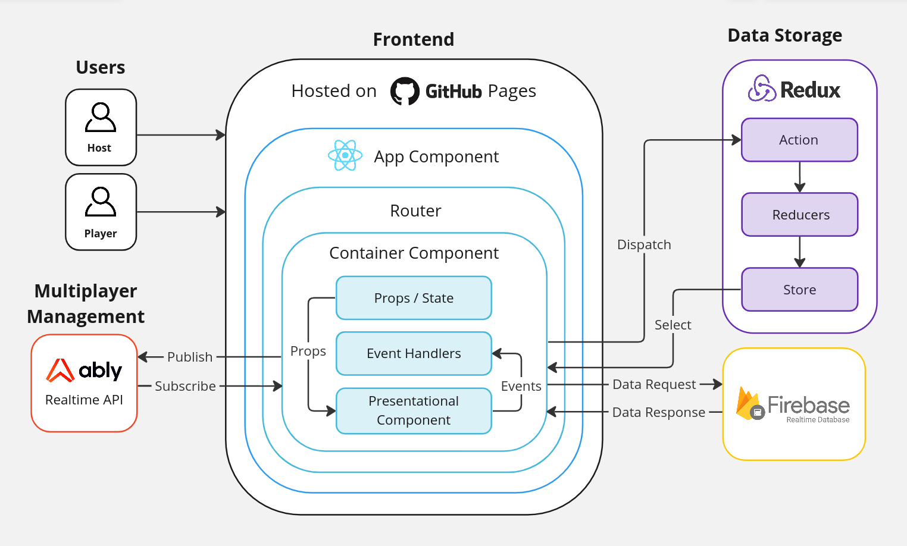
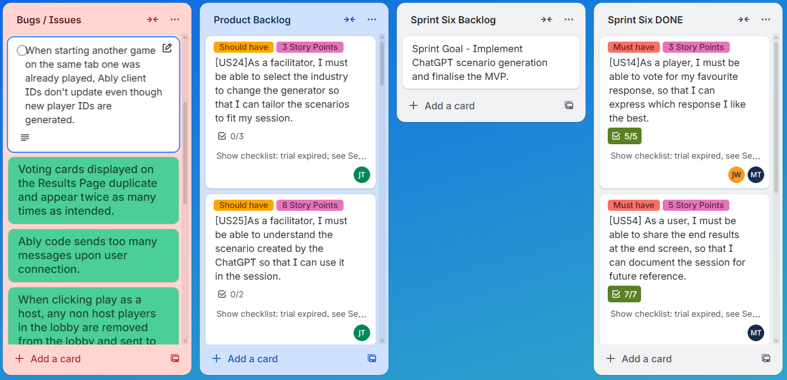

## Overview
A real-time, multiplayer web app to gamify chaos engineering in a workplace safety context. 

**Client brief included:**
- Create an installable web application which extends the potential of an existing interactive PDF.
- Boost user engagement and improving scenario generation by automating facilitation.
- Automate collection of session data, logging and creating a summary report for future reference.

### Background
Our client approached us with an existing PDF-based team activity intended to support workplaces in exploring staff responses in unpredictable scenarios, and then discuss how to mitigate risks. Results were manually recorded by a facilitator.  **They wanted us to develop an installable web app to impove usablility and user engagement with the product, and allow for automated session data collection.**

### Architecture
The final product is an **installable React web app** which utilises the **Firebase Realtime Database** to store session data.

To achieve realtime connection between users, the app was developed using the **Ably platform**. This allowed users to join a lobby and broadcast or recieve  data during the session using the publish-subscribe messaging pattern over websocket connections.

### Product

The product is a multi-player realtime app, where up to 8 players can join a session using a room code and seperate sessions can run concurrently. 

Once the session begins, players are shown an AI generated scenario which includes a workplace hazard. Players are then invited to type what their responses would be, discuss responses, and then vote on the best anonymous response. The next round then begins, adding a new factor to the previous scenario, and the discussion and voting phases are repeated. After a set number of rounds pass, the game ends, score and a PDF report of the responses is generated and can be downloaded.

#### Notable Features
- Real-time, multiplayer functionality.
- Host/Player user distinction.
- Game settings including number of rounds and timer length. 
- 'Skip to end' and 'add time' buttons to adjust gameplay mid-session.
- Downloadable PDF summary generation.

### Project Management
We followed the PMBOK 5-phase model as our overarching methodology, including the initiation, planning, execution, monitoring, and closing phases.

We chose to implement the Scrum methodology during the execution phase, splitting it into six two-week sprints including Sprint Planning, Spirint Review, and Retrospective meetings. Regular standup meetings and client meetings were also held. **I held both a Software Developer and Product Owner role.**

Trello was used for sprint tracking.

