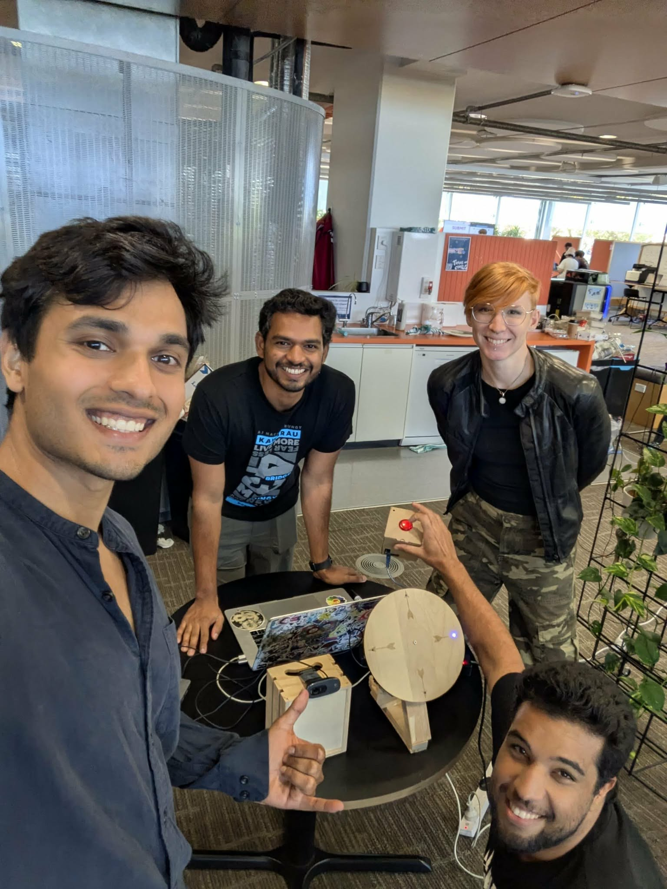

### Background

This project was part of the 2025 Terrible Ideas Hackathon. We had two days to implement a terrible idea with great execution. We decided to create a game to complete a maze you cannot see by moving around in real life, tracked through a webcam. The tracking was done using the **MediaPipe from Google APIs**. Directions to complete the maze were given through a wooden compass with embedded LED lights.

### Product



