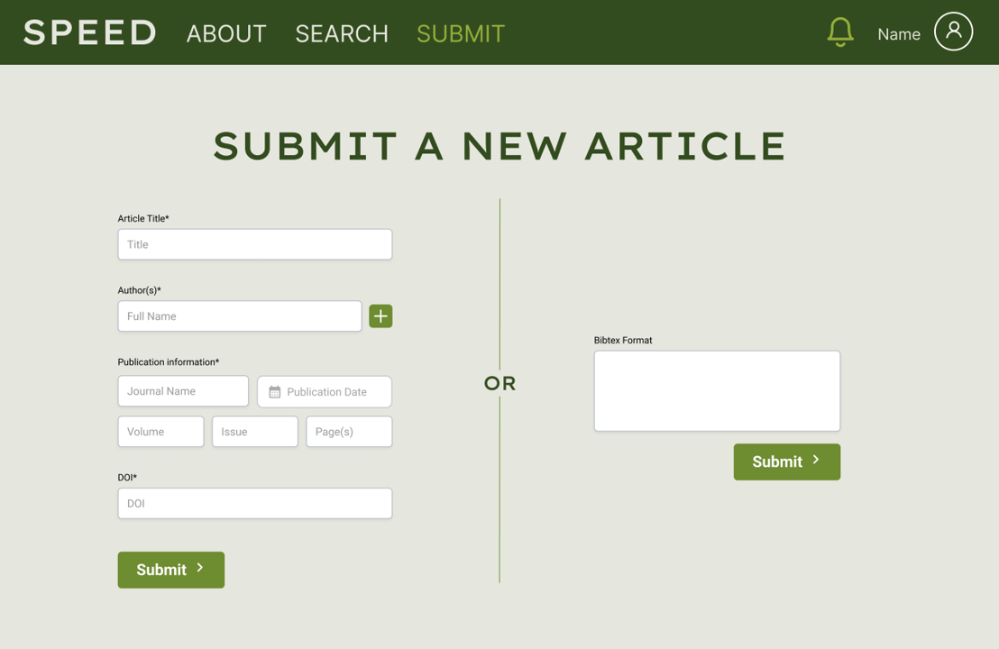
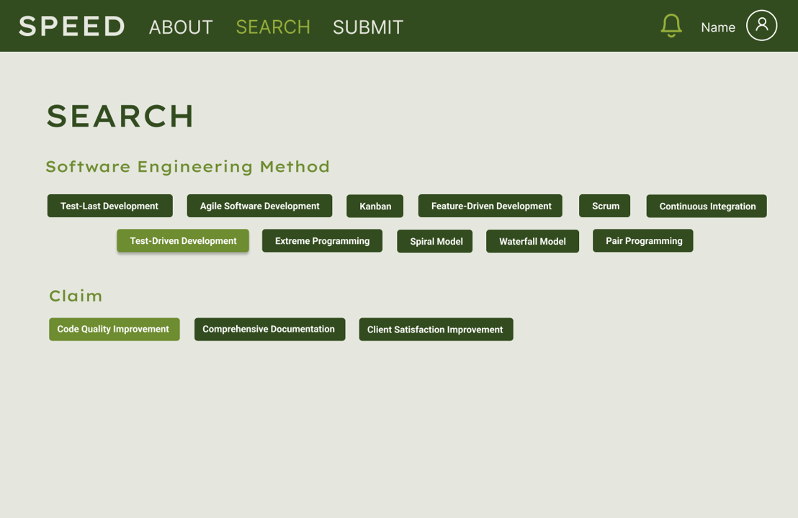
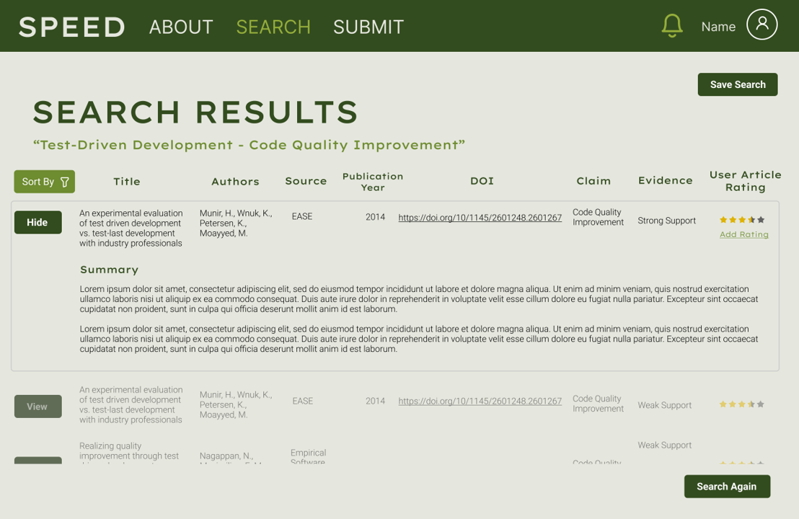
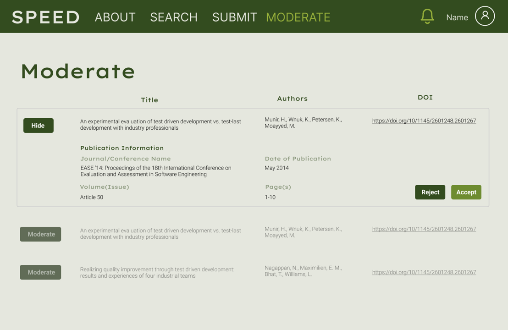
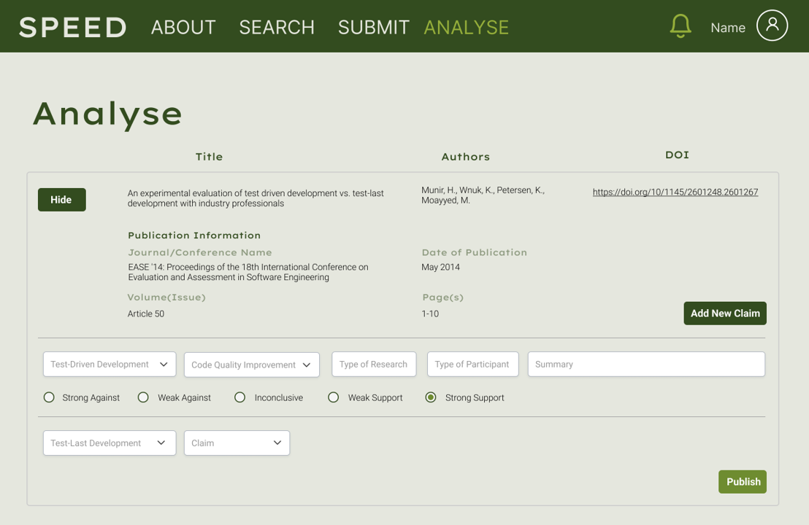
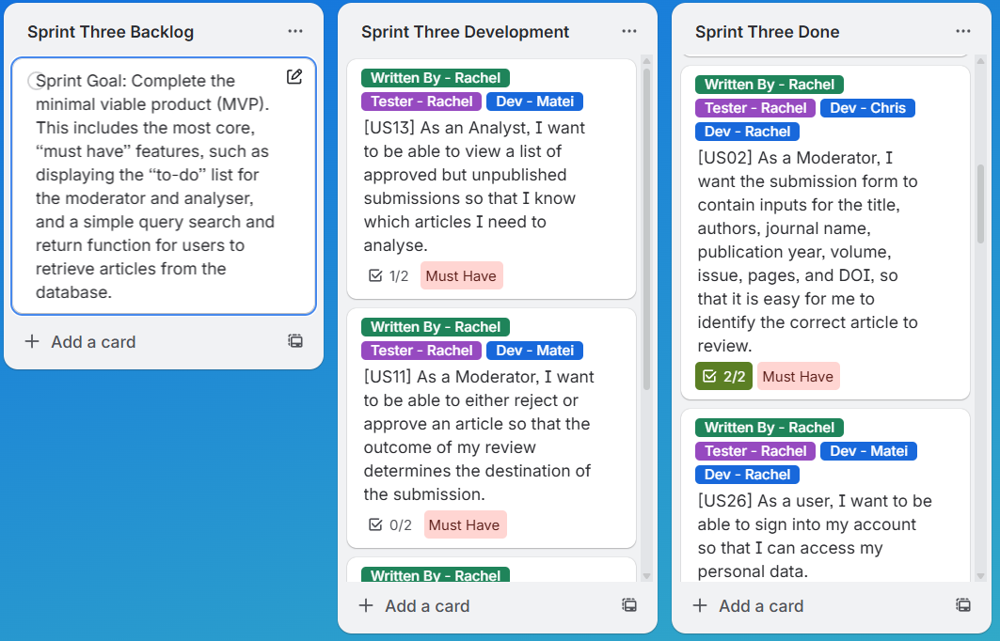

### Overview ###
SPEED is a database designed to store various software practices and analyse them based on evidence provided in relevant research papers. There are three user account types, with various levels of authorisation. 

The site was developed using the **Next.JS framework** and delployed on **Vercel**. **React** was used for the front-end, and **Node.js** and **Express** were used for the backend, and **MongoDB** was used for data storage.

### Product and Design ###
*Note: Site is no longer live, so screenshots below are from the Figma designs.*
- **Basic users** can search the database by software engineering method, e.g. Test-Driven Development, or claim, e.g. Code Quality, and find relevant research papers and their conclusions. They can also submit an article they think should be included in the database.

  
  

- **Moderators** review paper submissions submitted by users and accept or reject the paper's addition to the database.

- **Analysers** review the papers accepted by the moderators and tags the paper with relevant software development methods, claims, conclusion strengths, and a summary of the findings. They will then publish the entry to the database.

### Project Management ###
This project was carried out using the Agile Scrum methodology, in a three person team, with a two iteration development period. Trello was used to track user stories.

