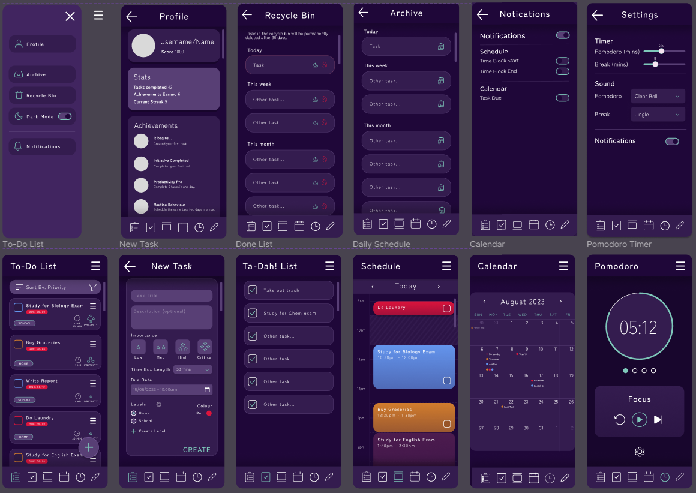
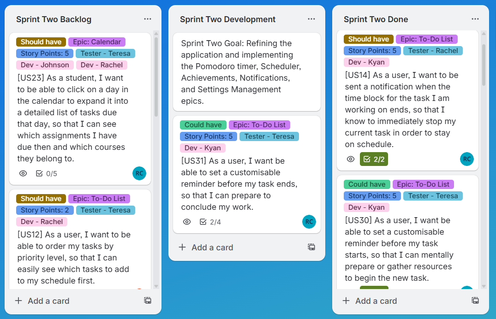

### Overview ###
TaskFlow is an Android app developed to consolidate various popular productivity techniques into a single tool. The application was developed in **.NET MAUI** and an **SQLite database** was used for data storage.

Product Features:
- To Do List (with task priority and deadlines).
  - Task editing, archiving, and recycle bin.
  - Task filtering by importance, due date, label, etc.
- A Pommodoro timer with customisation abilities.
- A "Ta-dah!" list (completed tasks).
- A day-view schedule to easily time block your calendar for specific tasks.
- A calendar to easily view task due-dates.
- A point system with achievements to gamify your productivity.

### Project Management ###
This project was carried out using the Agile Scrum methodology, in a four person team, with a two iteration development period. Trello was used to track user stories.

